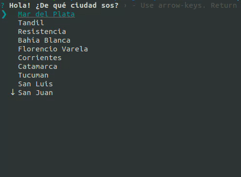
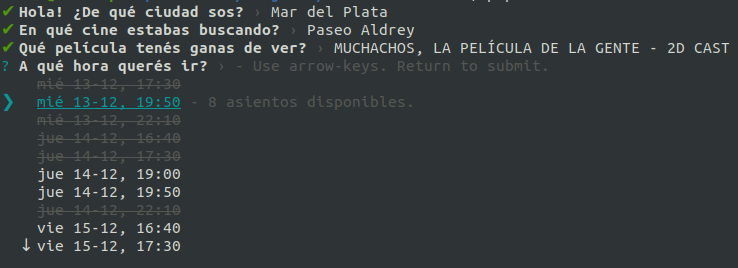
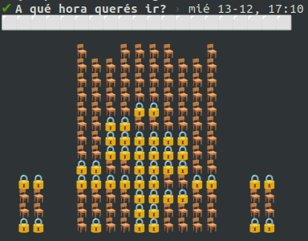
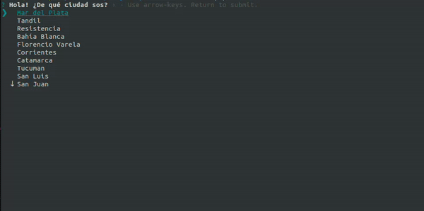

# CLI Mi Boleteria

Te parece que [Mi Boleteria](www.miboleteria.com.ar)
tiene una interfaz poco intuitiva y amigable? Con esta CLI vas a poder ver todas las funciones disponibles de forma rapida y sin salir de la terminal.

## Ventajas

<!-- Con tan solo elegir 4 opciones ya estas seleccionando la pelicula que quieras. Simple. -->

Comprar entradas nunca fue tan facil. Decinos dónde, qué y cuándo. Nosotros nos encargamos del resto.



Cansado de no saber que funciones tienen asientos disponibles? Nosotros te mostramos unicamente las que tienen entradas.



Ademas, te incluimos un mapa de los asientos disponibles para que los puedas ver facilmente.



Una vez que tengas la funcion elegida, te llevamos directamente a la pagina de mi boleteria para que eligas los asientos y compres tus entradas!



<!-- Acceso directo a la seleccion de butacas. Evita tener que repetir los datos que ya ingresaste. -->

<!-- - Incluye mapa de la sala para que veas cuales son las butacas disponibles. -->

## Uso

Empezar a usar esta herramienta es tan simple como:

```bash
pnpx cli-mi-boleteria
```
